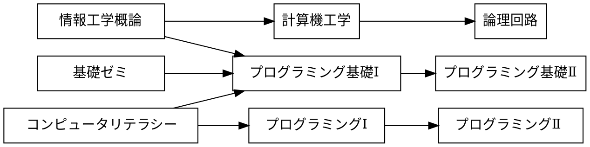

# 課題

## 課題 3.1 有向グラフ


プレビュー結果が上の図のようになるように，下記の記述を完成させよ．(接続関係が正しければ，上下が入れ替わっても構わない)

※ 日本語の文字列に対する箱の大きさが適切でない場合には，前後に空白を入れて調整せよ



## 課題 3.2 WBS


プレビュー結果が上の図のようになるように，下記の記述を完成させよ．(色や影などの違いは気にしなくてよい)

```plantUML
@startwbs ex02
* 拓殖大学
** 商学部
*** 経営学科
*** 国際ビジネス学科
*** 会計学科
** 就職学科
*** 法律政治学科
*** 経済学科
*** 社会安全学科
** 外国語学科
*** 英米語学科
*** 中国語学科
*** スペイン語学科
*** 国際日本語学科
** 工学部
*** 機会システム学科
*** 電子システム学科
*** 情報学科
*** デザイン学科
** 国際学部
*** 国際学科
@endwbs
```

## 課題 3.3 ユースケース図


プレビュー結果が上の図のようになるように，下記の記述を完成させよ．ただし，別名については適当に設定してよい．(色や影などの違いは気にしなくてよい)

```plantUML
@startuml ex03
left to right direction
actor 学生 as student
actor 教員 as teacher
rectangle {
    usecase "課題結果の採点" as points
    usecase "課題の受領" as uc2
    usecase "リポジトリのクローン" as rpjt
    usecase "課題ファイスの修正" as kdf
    usecase "修正をステージに上げる" as stage
    usecase "修正のコミット" as komit
    usecase "リモートリポジトリにpush" as push
    usecase "課題の登録" as touroku
}
student --> uc2
student --> rpjt
student --> kdf
student --> stage
student --> komit
student --> push
points <-- teacher
touroku <-- teacher
@enduml
```

## 課題 3.4 オリジナルの図解

「有向グラフ」「WBS」「ユースケース図」のどれかを使って，
独自の図解を作成せよ．対象は自由に決めてよいが，
誰かのコピーにならないように留意せよ．

```
```

```plantUML
@startwbs ex04
* Anime genre
** Comedy
*** Saiki Kusuo
*** Gintama
*** Crayon Shin-chan
*** Jojo
*** mashle
** Action
*** Jujutsu Kaisen
*** One piece
*** Naruto
*** Attack on titan
*** tokyo Revengers
*** Sword at online
*** Demon slayer
** Romance
*** Kaguya, love is war
*** Your name
*** Horimiya
*** Darling in the Franxx
*** My dress-up darling
** Slice of life
*** I want to eat your pancreas
*** Silent voice
*** Wolf Children
*** clannad
*** Grave of the firefly
** Horror
*** Akamega KIll
*** Mieruko-chan
*** Another
*** Death note
*** The promised neverland

@endwbs
```

## チェック
- [x] 課題 3.1 有向グラフ
- [x] 課題 3.2 WBS
- [x] 課題 3.3 ユースケース図
- [x] 課題 3.4 オリジナルの図解


